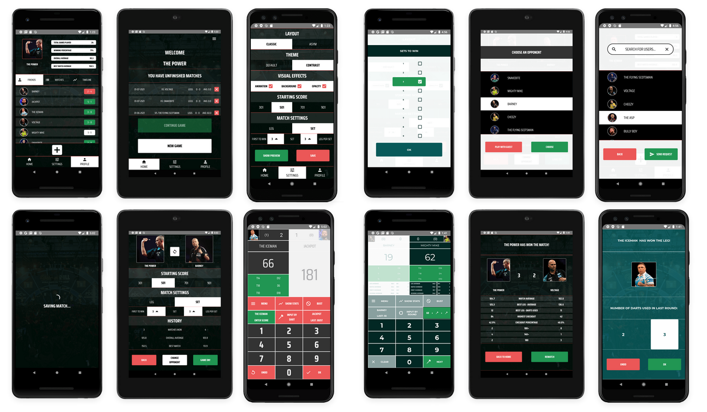

# Darts Scoreboard Mobile Application

Darts Scoreboard application built with React Native. The app contains a multi-level nested navigation system, user settings and stats, live data and profile syncing using Firebase and Express.
This is a hobby project for learning and trying out new technologies. 
I would like to publish it one day, but currently that is a not priority.
 

# Activities

- TypeScript will be added
- Firestore will be replaced by GraphQL/SQL database

***

## You can read more about the project by clicking on the link below:
[https://www.krisztiankovacs.dev/project/darts501](https://www.krisztiankovacs.dev/project/darts501)

